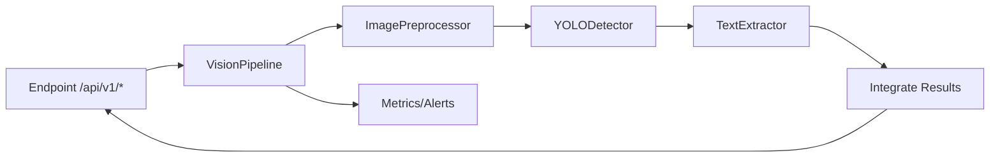

## Reconhecimento de Placas – Arquitetura e Guia de Execução

- Versão: 2.0.0
- Domínio: Visão computacional para detecção de objetos (placas/sinais) e OCR

### Descrição sobre o projeto

Sistema de visão computacional composto por pipeline modular para: pré-processamento de imagens, detecção de objetos via YOLO e extração de texto (OCR) nas regiões detectadas. Exponibiliza API REST (FastAPI) para inferência, integra monitoramento (métricas/alertas) e oferece opções de execução via Docker e local.

Principais capacidades:
- Detecção de placas de veículos e sinais de trânsito
- OCR nas regiões detectadas e integração detecção+texto
- API REST com health/status, upload e processamento em lote
- Monitoramento de desempenho e métricas

### Escopo de tecnologias utilizadas

- Linguagem e libs: Python, OpenCV, NumPy
- Detecção: YOLO (Ultralytics)
- OCR: PaddleOCR, EasyOCR ou Tesseract (fallback/simulador quando indisponível)
- API: FastAPI + Uvicorn
- Observabilidade: Prometheus + Grafana (via `monitoring/`)
- Orquestração/Empacotamento: Docker, docker-compose

### Arquitetura do projeto

Módulos principais:
- `vision/core/vision_pipeline.py`: pipeline que integra pré-processamento, detecção e OCR, e consolida resultados
- `vision/preprocessing/image_preprocessor.py`: redimensionamento, redução de ruído, contraste e filtros
- `vision/detection/yolo_detector.py`: detecção com YOLO (ou simulação)
- `vision/ocr/text_extractor.py`: extração de texto com PaddleOCR/EasyOCR/Tesseract (ou simulação)
- `vision/api/api_server.py`: servidor FastAPI, middlewares, rotas e handlers
- `vision/monitoring/*`: métricas, alertas e monitor de pipeline
- `config/vision_architecture.py`: presets de configuração (dev/prod/edge)

Porque essa arquitetura foi escolhida:
- **Modularidade**: componentes desacoplados (pré-processamento, detecção, OCR) facilitam evolução e substituição de tecnologias
- **Resiliência**: detectores/OCR com fallback simulados permitem desenvolvimento sem dependências pesadas
- **Observabilidade**: camadas de métricas e alertas para operação confiável em produção
- **Escalabilidade**: contêineres separados e possibilidade de paralelismo/batch; fácil horizontalização via Docker/K8s

### Diagrama de contexto (C4 – Nível 1)

Explicação: visão macro das interações entre usuários/sistemas externos e o sistema de visão. O objetivo é mostrar quem consome a API e quais integrações existem com observabilidade.

Fluxo do diagrama: o Cliente chama a API de Visão; a API processa imagem via Pipeline; métricas/alertas são enviados ao stack de observabilidade.

```mermaid
flowchart LR
  actor[Cliente/Aplicação Externa]
  api[API de Visão (FastAPI)]
  pipe[Pipeline de Visão]
  obs[Observabilidade (Prometheus/Grafana)]

  actor -->|HTTP/JSON| api
  api --> pipe
  pipe --> api
  api -->|Métricas/Alertas| obs
```

### Diagrama de containers (C4 – Nível 2)

Explicação: mostra os contêineres lógicos/deployáveis e suas responsabilidades.

Fluxo do diagrama: requisições chegam ao `API Server`; o `Vision Pipeline` orquestra `Preprocessor`, `YOLO Detector` e `Text Extractor`; métricas seguem para `Monitoring Stack`.

```mermaid
flowchart TB
  subgraph client[Cliente]
    app[App Web/Serviço Externo]
  end

  subgraph api[API Server (FastAPI/Uvicorn)]
    endpoints[Rotas REST]
    middle[Middlewares/Autenticação]
  end

  subgraph vision[Vision Pipeline]
    pre[Image Preprocessor]
    det[YOLO Detector]
    ocr[Text Extractor]
    integ[Integração Detecção+OCR]
  end

  subgraph mon[Monitoring Stack]
    prom[Prometheus]
    graf[Grafana]
  end

  app -->|HTTP| endpoints
  endpoints --> middle
  middle --> pre
  pre --> det
  det --> ocr
  ocr --> integ
  integ --> endpoints
  api -->|Métricas| prom
  prom --> graf
```

### Diagrama de componentes (C4 – Nível 3)

Explicação: detalha os principais componentes internos do pipeline e da API, com interfaces e dados trocados.

Fluxo do diagrama: `endpoints` convertem requisições em chamadas de alto nível ao `VisionPipeline`; cada componente transforma dados e propaga para o próximo, retornando resultados integrados com metadados de desempenho.



### Funcionalidades expostas (resumo)

- `GET /` e `GET /info`: metadata da API
- `GET /api/v1/health`: status do pipeline (tempo médio, uso de CPU/Mem, total processado)
- `POST /api/v1/upload`: upload de imagem para processamento (autenticado)
- Endpoints de detecção/OCR podem variar por implementação (ver `vision/api/endpoints.py`)

### Como executar

Requisitos mínimos:
- Python 3.9+
- (Opcional) GPU CUDA para YOLO/PaddleOCR

Instalação local:
```bash
python -m venv .venv && source .venv/bin/activate
pip install -r requirements.txt
```

Executar API (local):
```bash
python -m vision.api.api_server
# ou
uvicorn vision.api.api_server:get_app --host 0.0.0.0 --port 8000
```

Execução com Docker:
```bash
docker build -t placas-api -f Dockerfile .
docker run --rm -p 8000:8000 placas-api
```

Execução com docker-compose:
```bash
docker-compose up -d
```

Testes:
```bash
bash run_tests.sh
```

### Finalidades e casos de uso

- Vigilância e fiscalização: leitura de placas e sinais para auditoria/automação
- Análise de tráfego: detecção de veículos e contexto viário
- Automação industrial/logística: leitura de códigos/textos em imagens

### Observabilidade e operação

- Métricas e alertas configuráveis em `vision/monitoring/` e `monitoring/` (Prometheus/Grafana)
- Presets de configuração em `config/vision_architecture.py` para dev/prod/edge

### Notas

- Em ambientes sem dependências de YOLO/OCR, o sistema entra em modo simulado para desenvolvimento
- O modelo padrão esperado é `yolov8n.pt` na raiz do projeto (ou conforme configuração)

