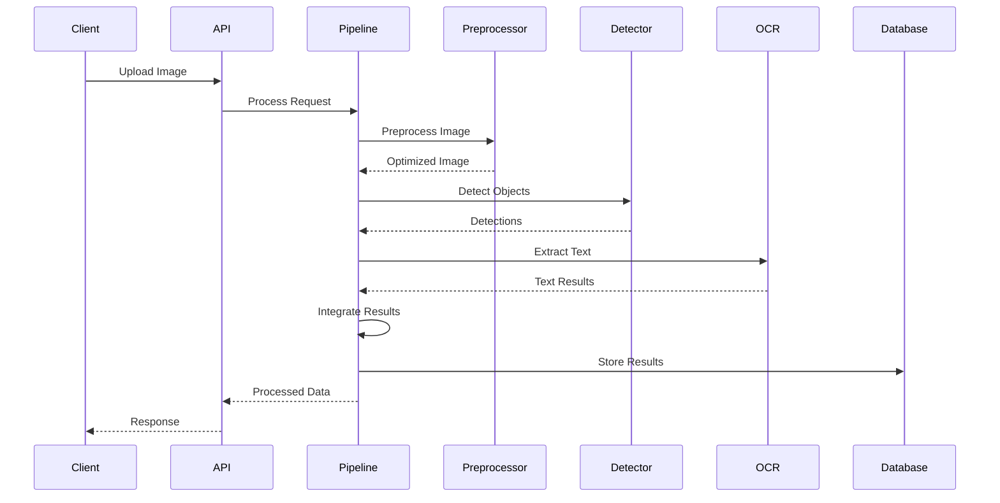
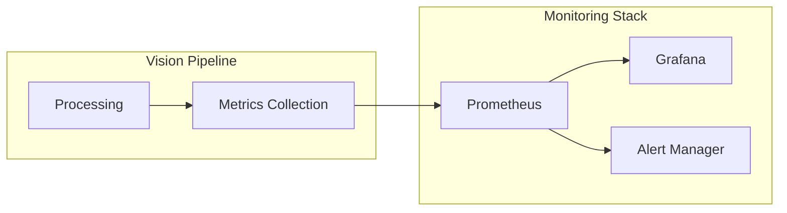

# 🏗️ **Visão Geral da Arquitetura**

## 🎯 **Objetivos de Design**

- **🔍 Escalabilidade**: Suporte a múltiplas instâncias e processamento paralelo
- **🔧 Manutenibilidade**: Código limpo, bem estruturado e documentado
- **📊 Observabilidade**: Métricas, logs e alertas centralizados
- **🔒 Segurança**: Autenticação JWT e autorização baseada em roles
- **🚀 Performance**: Processamento otimizado com cache e async
- **🔄 Flexibilidade**: Componentes desacoplados e configuráveis

## 🏛️ **Princípios Arquiteturais**

### **1. Separation of Concerns**
Cada módulo tem responsabilidade única e bem definida:
- **Preprocessing**: Preparação e otimização de imagens
- **Detection**: Identificação de objetos via YOLO
- **OCR**: Extração de texto das regiões detectadas
- **Integration**: Consolidação e validação dos resultados

### **2. Dependency Injection**
Inversão de controle para facilitar testes e manutenção:
```python
class VisionPipeline:
    def __init__(self, config: Dict[str, Any]):
        self.preprocessor = ImagePreprocessor(config['preprocessor'])
        self.detector = YOLODetector(config['detector'])
        self.text_extractor = TextExtractor(config['ocr'])
```

### **3. Event-Driven Architecture**
Comunicação assíncrona entre componentes:
- **Métricas**: Coleta automática de performance
- **Alertas**: Notificações baseadas em thresholds
- **Logs**: Rastreamento de operações

### **4. Fail-Fast Strategy**
Validação precoce e tratamento robusto de erros:
- Validação de entrada no nível da API
- Fallbacks para componentes críticos
- Logs detalhados para debugging

## 🏗️ **Arquitetura em Camadas**

```
┌─────────────────────────────────────────────────────────────┐
│                    PRESENTATION LAYER                      │
│  ┌─────────────┐ ┌─────────────┐ ┌─────────────┐          │
│  │   FastAPI   │ │  Dashboard  │ │   Swagger   │          │
│  │   Server    │ │     Web     │ │     Docs    │          │
│  └─────────────┘ └─────────────┘ └─────────────┘          │
└─────────────────────┬───────────────────────────────────────┘
                      │
┌─────────────────────▼───────────────────────────────────────┐
│                    BUSINESS LAYER                           │
│  ┌─────────────┐ ┌─────────────┐ ┌─────────────┐          │
│  │   Vision    │ │  Pipeline   │ │  Monitoring │          │
│  │  Pipeline   │ │  Manager    │ │   System    │          │
│  └─────────────┘ └─────────────┘ └─────────────┘          │
└─────────────────────┬───────────────────────────────────────┘
                      │
┌─────────────────────▼───────────────────────────────────────┐
│                    CORE LAYER                               │
│  ┌─────────────┐ ┌─────────────┐ ┌─────────────┐          │
│  │Preprocessor │ │   YOLO      │ │    OCR      │          │
│  │             │ │  Detector   │ │  Engine     │          │
│  └─────────────┘ └─────────────┘ └─────────────┘          │
└─────────────────────┬───────────────────────────────────────┘
                      │
┌─────────────────────▼───────────────────────────────────────┐
│                    INFRASTRUCTURE LAYER                     │
│  ┌─────────────┐ ┌─────────────┐ ┌─────────────┐          │
│  │ PostgreSQL  │ │    Redis    │ │   Storage   │          │
│  │   Database  │ │    Cache    │ │   Service   │          │
│  └─────────────┘ └─────────────┘ └─────────────┘          │
└─────────────────────────────────────────────────────────────┘
```

## 🔄 **Fluxo de Dados**

### **1. Processamento de Imagem**


### **2. Monitoramento e Métricas**


## 🔧 **Componentes Principais**

### **Vision Pipeline**
- **Responsabilidade**: Orquestração do processamento
- **Características**: Modular, configurável, monitorável
- **Interfaces**: REST API, WebSocket para tempo real

### **Image Preprocessor**
- **Responsabilidade**: Otimização de imagens
- **Operações**: Redimensionamento, redução de ruído, contraste
- **Configuração**: Parâmetros ajustáveis via config

### **YOLO Detector**
- **Responsabilidade**: Detecção de objetos
- **Modelo**: YOLOv8 configurável
- **Fallback**: Modo simulado para desenvolvimento

### **Text Extractor**
- **Responsabilidade**: Extração de texto via OCR
- **Motores**: PaddleOCR, EasyOCR, Tesseract
- **Fallback**: Simulador para desenvolvimento

## 📊 **Padrões de Design**

### **Factory Pattern**
```python
class ComponentFactory:
    @staticmethod
    def create_preprocessor(config: Dict) -> ImagePreprocessor:
        return ImagePreprocessor(config)
    
    @staticmethod
    def create_detector(config: Dict) -> YOLODetector:
        return YOLODetector(config)
```

### **Strategy Pattern**
```python
class OCRStrategy(ABC):
    @abstractmethod
    def extract_text(self, image: np.ndarray) -> TextResult:
        pass

class PaddleOCRStrategy(OCRStrategy):
    def extract_text(self, image: np.ndarray) -> TextResult:
        # Implementação PaddleOCR
        pass
```

### **Observer Pattern**
```python
class PipelineObserver:
    def on_processing_start(self, image_path: str):
        pass
    
    def on_processing_complete(self, result: ProcessingResult):
        pass
    
    def on_error(self, error: Exception):
        pass
```

## 🚀 **Escalabilidade**

### **Horizontal Scaling**
- **API Servers**: Múltiplas instâncias FastAPI
- **Load Balancer**: Distribuição de carga
- **Shared State**: Redis para cache e sessões

### **Vertical Scaling**
- **GPU Support**: Aceleração CUDA para YOLO/OCR
- **Memory Optimization**: Processamento em lotes
- **Async Processing**: Operações não-bloqueantes

## 🔒 **Segurança**

### **Autenticação**
- **JWT Tokens**: Stateless authentication
- **Refresh Tokens**: Renovação automática
- **Role-Based Access**: Controle granular de permissões

### **Validação**
- **Input Validation**: Pydantic models
- **File Upload**: Validação de tipos e tamanhos
- **Rate Limiting**: Proteção contra abuso

## 📈 **Monitoramento**

### **Métricas Coletadas**
- **Performance**: Tempo de processamento, throughput
- **Qualidade**: Taxa de sucesso, precisão das detecções
- **Recursos**: CPU, memória, GPU utilization
- **Negócio**: Volume de imagens, tipos de detecções

### **Alertas**
- **Performance**: Tempo de resposta alto
- **Disponibilidade**: Serviços down
- **Qualidade**: Taxa de erro alta
- **Recursos**: Uso excessivo de CPU/memória

---

**📖 Próximo**: [Diagramas da Arquitetura](diagrams.md) ou [Decisões Arquiteturais](decisions.md)
